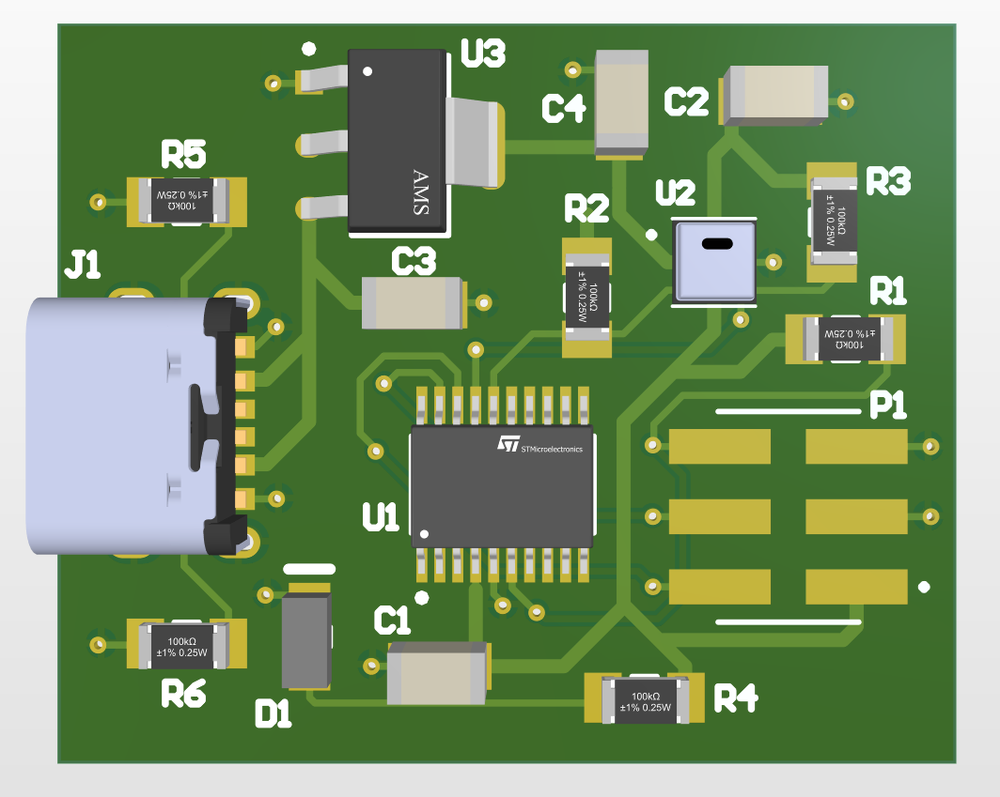
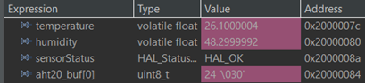
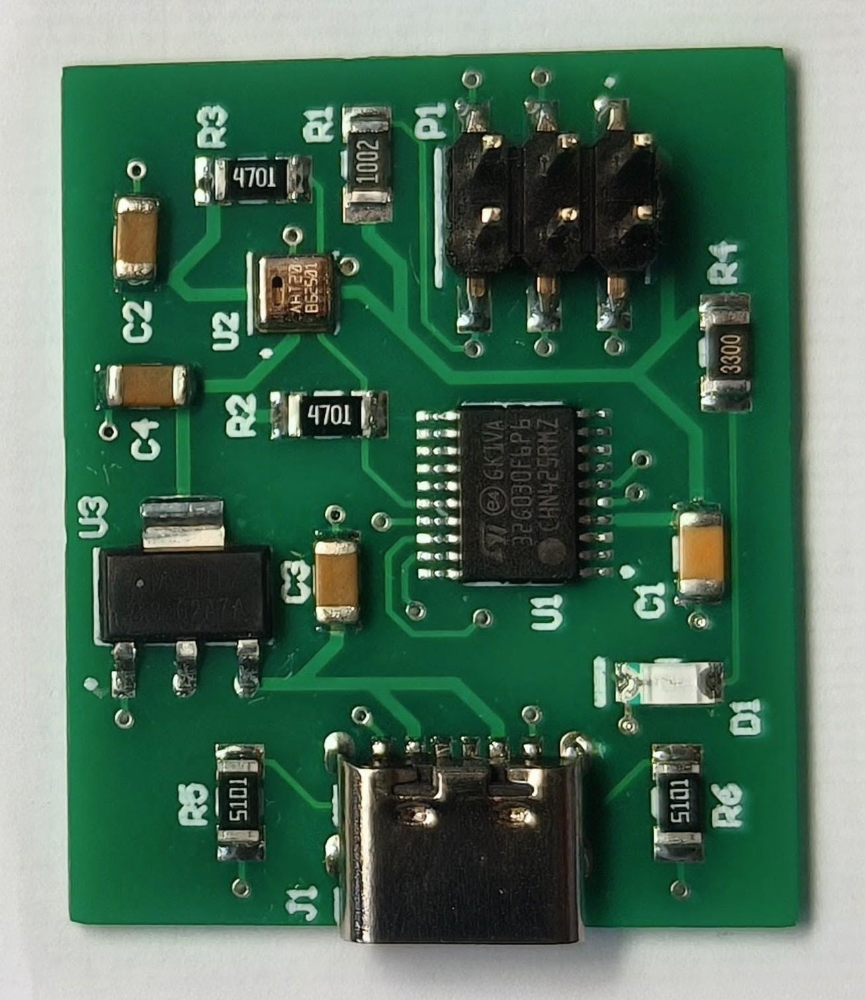

# STM32 Environmental Sensor (AHT20)

## Overview
This project is a custom environmental sensor node designed to measure temperature and humidity. It is built around the STM32G030F6P6 microcontroller and the AHT20 sensor. The goal of the project was to design a complete hardware-software system, from the schematic and PCB layout to bare-metal firmware implementation.

## Key Features
* **Microcontroller:** STM32G030F6P6 (Cortex-M0+).
* **Sensor:** AHT20 (I2C interface) for high-accuracy climate monitoring.
* **Power Supply:** USB-C 6-pin interface with 5V to 3.3V regulation.
* **Programming:** Standard 2x3 SWD header for ST-Link.
* **Firmware:** Developed in C using direct register access (Bare-Metal).

## Hardware Design
The hardware was designed in Altium Designer. 

**[View Full Schematic (PDF)](Docs/schema.pdf)**

Key design choices include:
* **Voltage Regulation:** AMS1117-3.3 (SOT-223) to provide stable power for the MCU and sensor.
* **USB-C Integration:** 5.1kΩ pull-down resistors on CC1/CC2 lines to ensure compatibility with modern USB-C chargers.
* **Component Selection:** Primarily SMD 1206 footprints for easy manual assembly while maintaining a compact form factor.
* **PCB:** 2-layer design with a solid ground plane for improved EMI performance.

## Project Structure
* `/hardware` - Altium Designer schematics and PCB layout files.
* `/software` - Source code (C), including I2C drivers and peripheral initialization.
* `/Docs` - Datasheets, technical documentation, and project media.

## Learning Objectives
* Mastering professional PCB design workflow in Altium Designer.
* Understanding I2C communication protocol at the register level.
* Implementing hardware-specific features like USB-C power negotiation.

Project developed as part of technical self-education in Embedded Systems.

---

## Project Presentation

### Live Sensor Readings (STM32CubeIDE)

### Assembled Hardware Board

